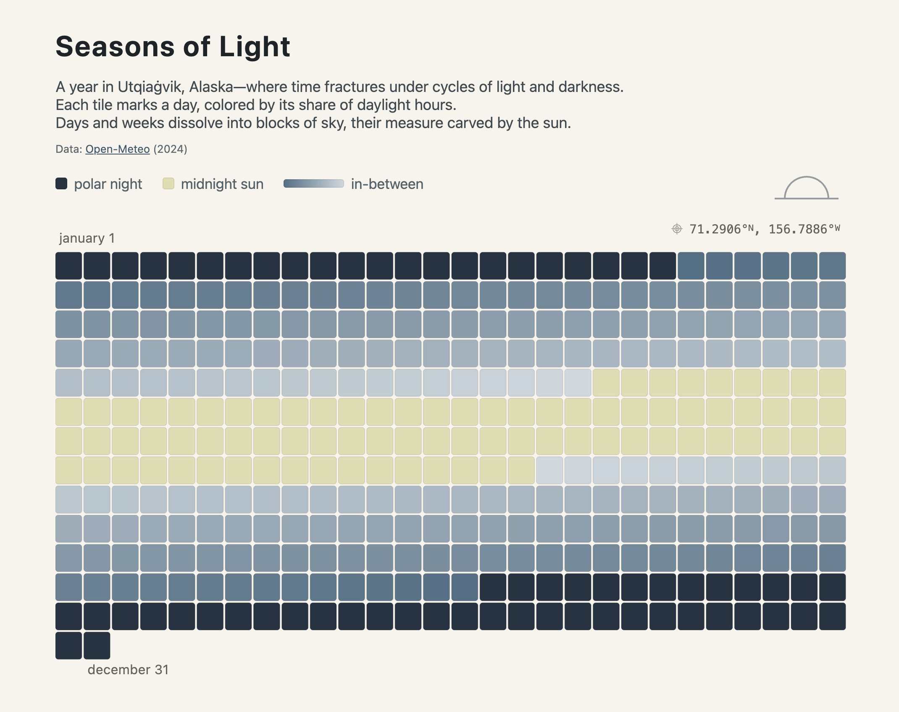

# Seasons of Light

A small dataviz capturing a year of daylight in Utqiaġvik, Alaska (2024).  
Each tile marks a day, colored by its share of daylight hours: from polar night (0h) to midnight sun (24h).

**Live demo:** https://lara-yeyati-preiss.github.io/seasons-of-light/

## How it works
- One tile = one day.  
- Color encodes hours of daylight: flat colors for 0h (polar night) and 24h (midnight sun); a smooth gradient for values in between.  
- A tooltip shows the date, category, and daylight.
